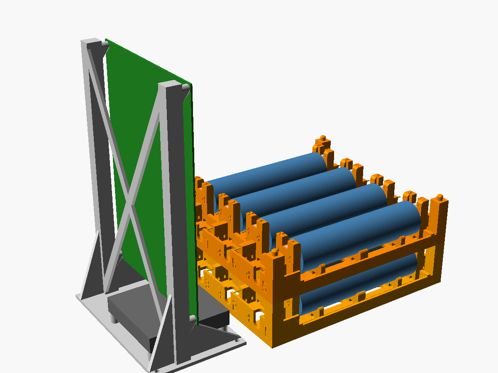

# LFP-8: 40-cell LiFePO4 33140 charger / discharger / IR tester

An open hardware tester for LiFePO4 32140/33140 cells. One **LFP-8 board**
handles **8 cells**. Five boards, JLCPCB's minimum order, test **40 cells at
once**. Each channel can

* **charge** with constant current then constant voltage: ≈ 1.0 A, CV 3.58 V,
  hardware OV latch at 3.82 V
* **discharge** at ≈ 1.07 A, with a hardware under-voltage backstop at 2.22 V
* measure **capacity** (coulomb counting, mAh/mWh) and **internal resistance**
  (pulse method, R_ohmic at 10 ms and DC-IR at 1 s) through true **4-wire
  Kelvin** connections
* read a 10 k **NTC** on every cell

Every board reports over Wi-Fi: a web dashboard and a JSON API served by its
ESP32-C3. The boards find each other, so any one of them shows all 40 cells.

| | |
|---|---|
|  |  |
| LFP-8 PCB (216 × 146 mm, 2 layers, JLCPCB assembly) | 3D-printed 8-cell module + board stand (Ender 3 S1 Pro) |

## Repository map

| Path | What |
|---|---|
| [`docs/DESIGN.md`](docs/DESIGN.md) | Architecture, circuit description, design numbers |
| [`docs/INTERFACE.md`](docs/INTERFACE.md) | Hardware ⇄ firmware contract: GPIO map, shift-register bits, thresholds, measurement formulas |
| [`docs/TEST_REPORT.md`](docs/TEST_REPORT.md) | Results of every simulation, adversarial and board-level test |
| [`docs/ORDERING_AND_ASSEMBLY.md`](docs/ORDERING_AND_ASSEMBLY.md) | How to order from JLCPCB, hand-solder parts, wiring, bring-up |
| `hardware/gen/` | **Single source of truth**: the netlist DSL (`lfp8_circuit.py`) and the generators for schematic, PCB, routing, checks and fab files |
| `hardware/kicad/` | Generated KiCad 7 project (schematic, PCB, project library) |
| `hardware/fab/` | Gerbers, drill, JLCPCB BOM + CPL, DRC report, check report |
| `sim/` | ngspice models, benches and the pytest suite (functional, adversarial, Monte Carlo, loop stability) |
| `firmware/` | ESP32-C3 Arduino firmware, web UI, REST API, IR calculator, host tests and simulator |
| `mechanical/` | OpenSCAD holder (4-cell cradles, board stand), STLs, printability checks |

## Quick start

1. **Order PCBs**: upload `hardware/fab/lfp8_gerbers.zip`, then
   `lfp8_bom_jlcpcb.csv` and `lfp8_cpl_jlcpcb.csv` for assembly. Details in
   [ORDERING_AND_ASSEMBLY.md](docs/ORDERING_AND_ASSEMBLY.md).
2. **Print the holders**: `mechanical/stl/`, 10 cradles + 5 board stands, PETG,
   no supports.
3. **Flash the firmware** through the J3 USB header:
   `make -C firmware build upload`, or open `firmware/lfp8` in the Arduino IDE
   with the ESP32 core, board *ESP32C3 Dev Module*, partition scheme
   *Minimal SPIFFS*.
4. **Power**: 5.20 V, ≥ 10 A per board. Join the board's Wi-Fi AP `LFP8-<id>` (password `lfp8admin`)
   and open `http://192.168.4.1`, or configure your Wi-Fi and use
   `http://lfp8-<id>.local`.

## Safety features (hardware, independent of firmware)

| Feature | Behaviour |
|---|---|
| CV limit | Kelvin-sensed 3.576 V (3.51–3.62 V worst case); firmware also stops at 3.60 V |
| OV latch | 3.82 V: cell isolated + charger drive killed until the cell is removed or SAFE_EN cycles |
| UV backstop | discharge stops at 2.22 V under load even if firmware hangs |
| Charge/discharge interlock | the charger is forced off while the load is on |
| Reverse cell | detected in < 50 µs; cell isolated (0.1 mA residual) whether the board is powered or not |
| Back-to-back isolation FETs | an unpowered board does not drain or back-feed the cells (81 µA residual) |
| Watchdog | a stuck or too-slow firmware loop (< 100 Hz heartbeat) shuts every channel down in 23–33 ms |
| Rail UV / OV | 4.48 V / 5.49 V |
| Board over-temperature | 70–95 °C → all channels off |
| E-STOP button | all channels off in 126 µs |
| PTC fuse per channel | 2 A hold; a board-side short trips in 0.22 s |
| TVS + reverse crowbar on the 5 V input | |

## Running the tests

```bash
./run_all_tests.sh          # ngspice suite, netlist + DRC checks, firmware tests, holder checks
QUICK=1 ./run_all_tests.sh  # shorter Monte Carlo
```

Regenerate the hardware from the DSL with `make -C hardware` (KiCad 7,
Freerouting 2.x and Java are required for routing).
