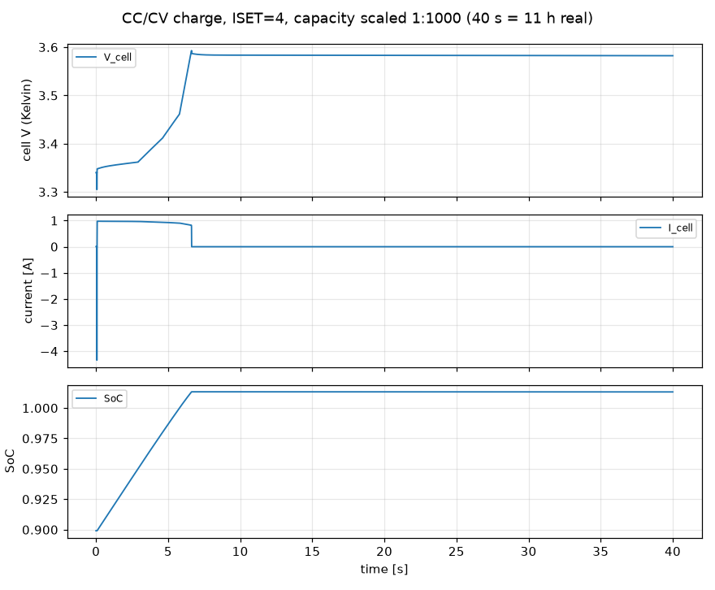
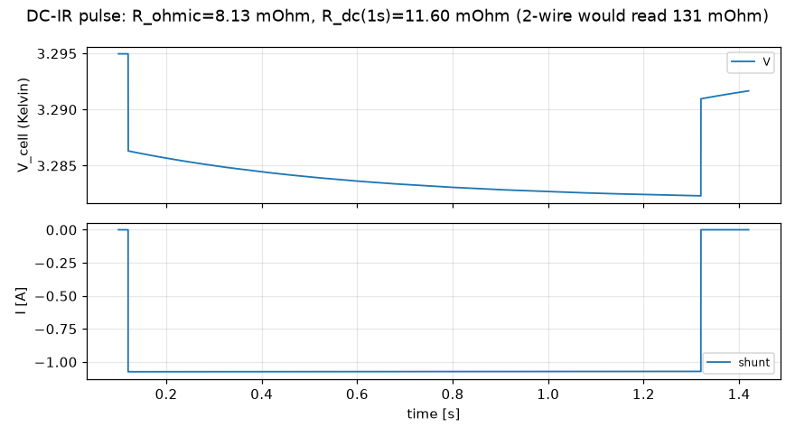
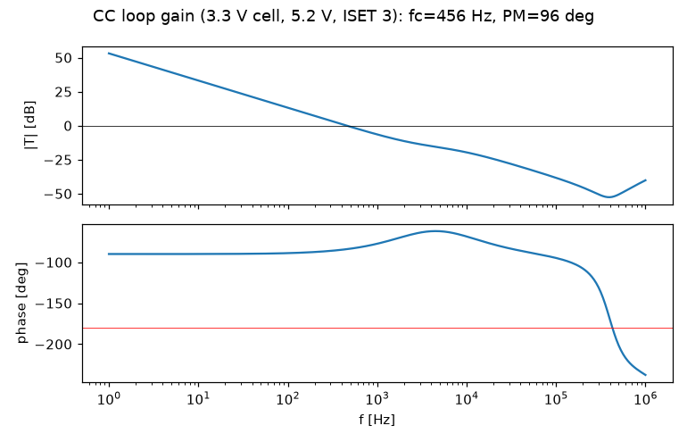
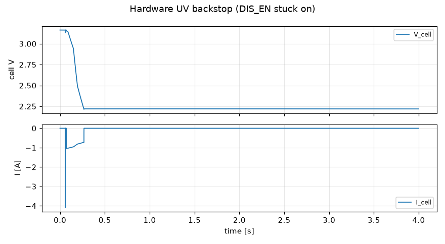
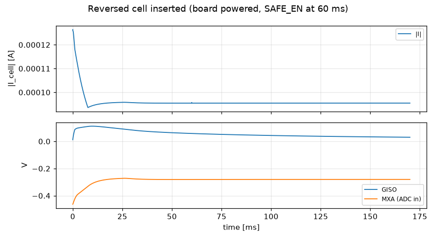
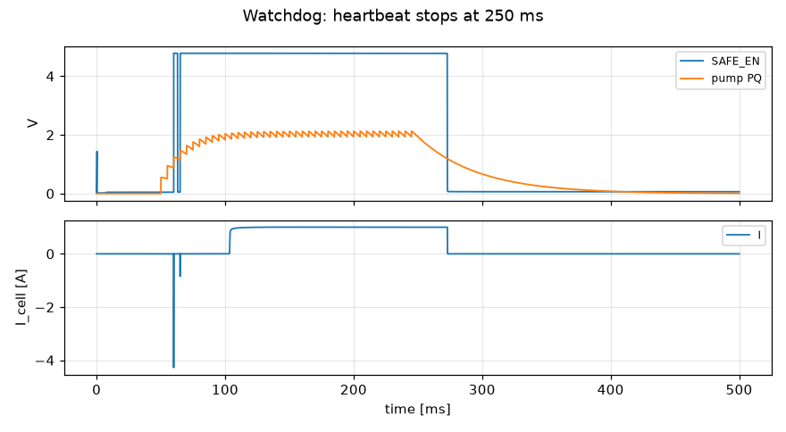
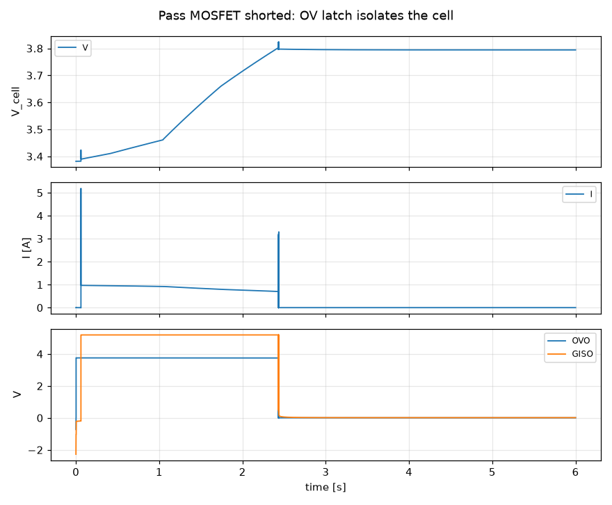
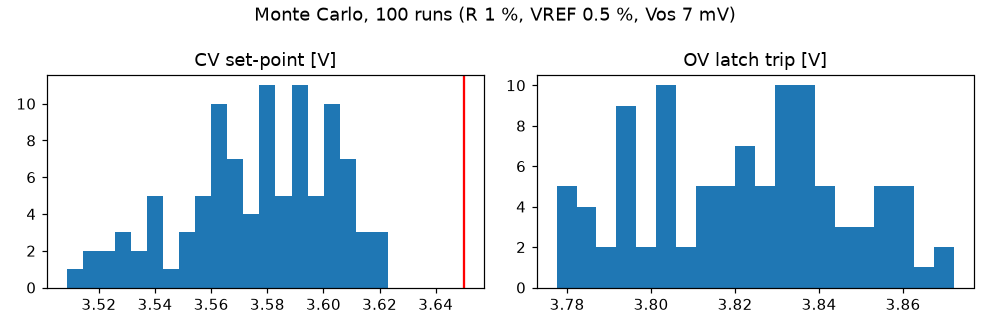
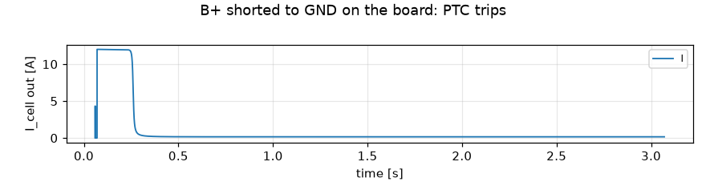
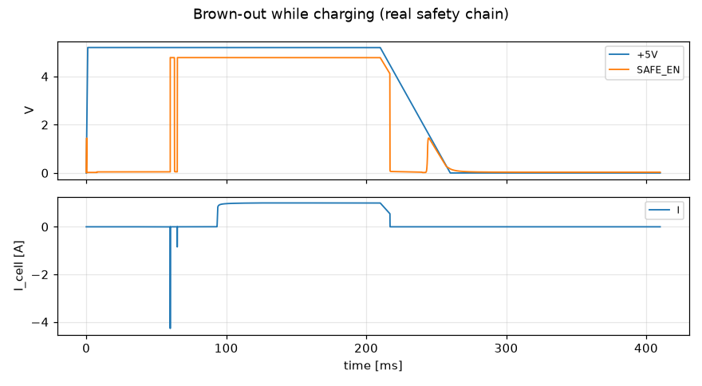

# LFP-8 test report

Everything here is reproducible with `./run_all_tests.sh`. Raw numbers:
`sim/results/summary.json` (ngspice), `hardware/fab/check_report.json`
(PCB) and `hardware/fab/drc_report.txt` (KiCad DRC).

| Suite | Tests | Result |
|---|---|---|
| ngspice: functional + adversarial + Monte Carlo + stability (`sim/tests`) | 32 | **all pass** |
| Schematic netlist == DSL netlist (`verify_netlist.py`) | 835 parts, 431 nets | **pass** |
| PCB: DRC, PCB netlist == DSL, current capacity, BOM (`check_pcb.py`) | see §4 | see §4 |
| Firmware host tests (`make -C firmware test`) | 78 tests, 2230 checks + simulated 8-cell capacity run | **all pass** |
| Firmware ESP32-C3 build (arduino-cli, esp32 core 3.3.12) | flash 63 %, RAM 50 % | **pass** |
| Holder printability (`mechanical/check_printability.py`) | mesh + fit checks | **pass** |

## 1. Simulation setup

* ngspice 42 transient and AC analysis of the **exact** circuit that goes to
  the PCB: the netlist is generated from `hardware/gen/lfp8_circuit.py`.
* Models (`sim/models/lfp8_models.lib`):
  * LM324 / LM358: tanh input stage, GBW 1.2 MHz, Aol 100 dB, slew rate 0.5 V/µs,
    output high VCC − 1.5 V, input offset as a parameter
  * LM393: open-collector output
  * CJ431: shunt reference with VREF0 as a parameter
  * FETs: VDMOS AO3400A / AO3401A / 2N7002 / BSS138 with body diodes and
    capacitances
  * BJTs, Schottky diodes, TVS, LEDs
  * PTC: electro-thermal model, I_hold 2 A
  * LFP cell: OCV(SoC) table, R0 8 mΩ, two RC polarisation branches
    (4 mΩ / 0.5 s and 5 mΩ / 60 s); capacity is scaled down in the
    time-compressed tests
* Monte Carlo, 100 runs:
  * resistors ±1 %
  * CJ431 VREF ±0.5 %
  * LM324 offset: normal, σ 2.3 mV, truncated at ±7 mV

## 2. Functional results

| Test | Result | Pass criterion |
|---|---|---|
| CC→CV charge cycle (90 % → full) | I_CC 0.970 A, V_max 3.593 V, ends at 3.582 V / 0 A | CV ≤ 3.62 V, no overshoot past the OV latch |
| ISET DAC codes 0–7 at 3.30 V cell | 0 / 0.260 / 0.517 / 0.772 / 1.003 / 1.003 / 1.003 / 1.003 A | monotonic, code 0 blocks |
| Discharge current at 3.29 V | 1.075 A (R_eff 3.06 Ω incl. FET + shunt + wiring) | 1.0–1.15 A |
| IR measurement (Kelvin), cell R_ohmic 8.08 mΩ / R_dc 11.54 mΩ | 8.13 mΩ / 11.60 mΩ (+0.6 %) | ±3 %; a 2-wire reading would show 131 mΩ |
| Empty slot | reads 0.033 V, charger open-circuit V 3.572 V, no oscillation | firmware detects `EMPTY` |
| CC loop stability (Middlebrook, 23 corners: SoC, rail 4.75–5.25 V, cell R, ISET) | worst phase margin 90.3°, f_c 26 Hz – 1.3 kHz | PM ≥ 45° |
| CV loop stability (7 corners) | worst phase margin 94.0° | PM ≥ 45° |

## 3. Adversarial / fault-injection results

| Attack / fault | Result | Criterion |
|---|---|---|
| Firmware forgets to stop the discharge | hardware cuts off at **2.218 V** under load, no restart (rest 2.219 V) | ≥ 2.0 V, latched off |
| Discharge request on a 2.50 V cell | refused (0.1 mA) | < 1 mA |
| CHG_EN and DIS_EN both high | charge path 0.00002 A (was 0.987 A), discharge continues | charger forced off |
| Reversed cell while idle / charging / discharging | 0.1 mA steady, isolation FET gate 0.03–0.04 V, min IC input −0.46 V | < 1 mA, no IC input below −0.5 V |
| Reversed cell hot-plugged into a charging channel | 28 A peak for **52 µs** (0.05 mC), then 0.06 mA | < 100 µs, latched off |
| Unpowered board, cell inserted | 81 µA drain (58 mAh/month) | < 200 µA |
| Brown-out while charging (rail ramps down) | SAFE_EN drops at **4.48 V**, max reverse current 0.08 mA | no back-feed |
| Heartbeat stops (stuck low / stuck high) | SAFE_EN falls after **22.9 / 32.8 ms**, all outputs off | < 50 ms |
| Heartbeat frequency 20 / 50 / 100 / 200 / 1000 Hz | trips / trips / ok / ok / ok | ≤ 50 Hz must trip |
| Rail over-voltage 6 V | SAFE_EN 0.07 V, cell current 0.1 mA; recovers after | isolate |
| Board over-temperature 25 / 70 / 95 °C | ok / ok / **tripped** | trip between 70 and 95 °C |
| E-STOP pressed while charging | cell isolated in **126 µs** | < 1 ms |
| Pass FET shorted (D–S) during charge | OV latch at **3.824 V**, cell isolated (16 µA) | ≤ 3.9 V, isolated |
| B+ sense wire open / B− sense wire open | V_cell max 3.583 / 3.578 V | no over-charge |
| Board-side short across a channel | 12 A peak, PTC trips in **0.22 s**, 0.16 A after | PTC protects |
| Cell hot-plugged into a charging channel | 1.41 A inrush, settles 1.007 A, no false OV latch | < 2 A |
| Cell removed while charging | BP rises to 5.11 V max, OV latch released | no damage, recovers |
| Shift-register outputs high-Z (SAFE_EN low) | cell current 0.17 mA | everything off |
| Monte Carlo (100 runs) | CV 3.509–3.623 V (σ 26.7 mV), OV 3.778–3.872 V, min OV−CV margin **155 mV** | CV ≤ 3.65 V, margin ≥ 100 mV |
| Thermal budget | Q1 ≤ 0.38 W (continuous above 3.05 V; pulsed below), 1.2 Ω 1.27 W, each 11 Ω 1.01 W, board 32.9 W discharging | SOT-23 ≤ 0.4 W, 2512 ≤ 2 W |

Design bugs these tests found and fixed during development:
* integrator wind-up (fixed by soft start through anti-windup diodes)
* single-ended CV sense (made differential/Kelvin)
* OV latch tripping at power-up
* CC loop instability caused by an unbalanced differential integrator
* pass-FET over-temperature on deeply discharged cells (now a pulse policy
  enforced by firmware)
* reverse current through the isolation FET body diode
* isolation gate referenced to GND instead of the common source
* empty slot detected as a reversed cell
* sentinel unable to act while B+ is negative (added a complementary transistor)
* excessive unpowered drain (dividers scaled ×10)
* watchdog accepting a 20 Hz heartbeat

## 4. PCB checks

PCB_RESULTS_PLACEHOLDER

## 5. Firmware

`make -C firmware test` builds the portable controller core on the host and
runs 78 unit tests (2230 checks). They cover:
* the charge, discharge, capacity and IR state machines
* the thermal pulse policy
* the OV-latch reset sequence
* the shift-register bit map and interlock
* mux settling and the VCHK cross-check
* empty and reversed slots
* the JSON API
* the watchdog timing
* IR bursts: 8 simultaneous IR tests, and 3 IR tests while 5 channels discharge,
  finish without starving the scanner. This is a regression test for a bug found
  in review: queued IR pulses used to run back to back and fault the other
  channels with `FAULT_ADC`. The scanner now runs at most one IR pulse per
  full sweep.

A simulated 8-cell capacity test (`sim_cell_test`) checks the controller
against cell models with hardware CV spread 3.51–3.62 V:
* reported capacity within 0.24 % of the model
* IR within 0.15 mΩ
* never more than 1 s of continuous charge below 3.0 V

Hardware-in-the-loop testing has **not** been done: no boards exist yet.
Follow the bring-up checklist in
[ORDERING_AND_ASSEMBLY.md](ORDERING_AND_ASSEMBLY.md).
