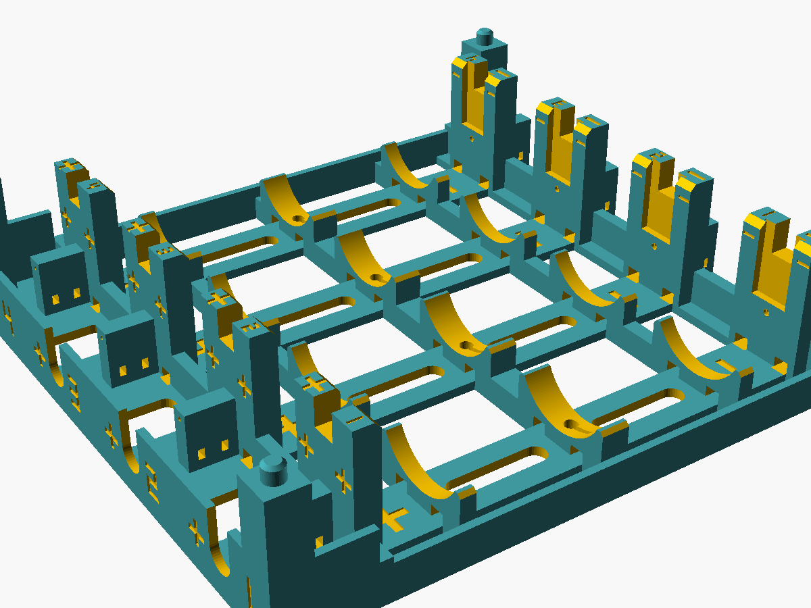
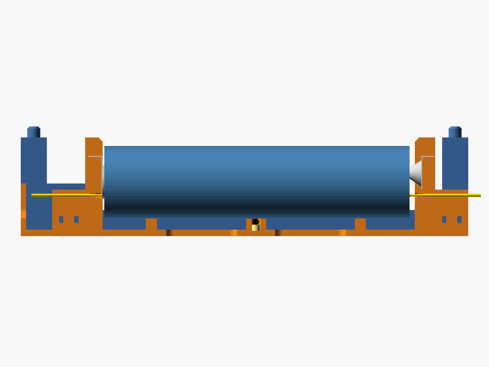
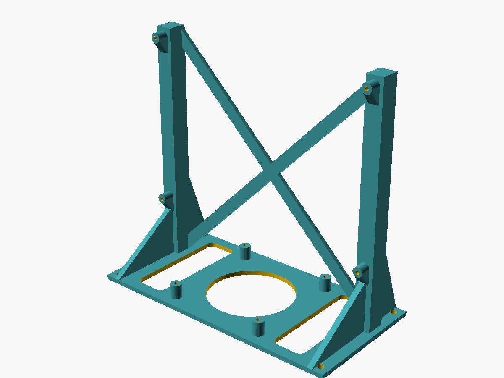

# LFP-8 cell holder system (40 × LiFePO4 33140)

3D-printable, parametric holders for the 40-cell LFP-8 tester. Five LFP-8 boards with
8 channels each test 40 cells. Every cell gets a **4-wire Kelvin** connection (force and
sense at each terminal) plus an NTC bead under the cell.

* **Cradle**: 4 cells lying side by side. Two cradles stack (pins/sockets) into one
  **8-cell module per LFP-8 board**. 10 cradles = 40 cells.
* **Board stand**: holds one LFP-8 PCB vertically next to the module, with 4 × M3
  standoffs and a 60/80 mm 5 V fan under the board blowing up across both faces.
* Accessories: **board tray** (PCB lying flat on top of a module, fan blowing across it)
  and **pogo gauge** (sets the pogo pin protrusion).

Everything is generated from one OpenSCAD file. Every part prints in its modelled
orientation **without supports** on a Creality Ender 3 S1 Pro, inside a
210 × 210 mm footprint and under 260 mm height.

| | |
|---|---|
|  |  |
| 4-cell cradle (channels 1–4) | 8-cell module (2 cradles) + LFP-8 board stand |
|  |  |
| Section through one cell: + plate, + pogo, NTC bead, − spring, − pogo | Board stand (fan posts, gusseted M3 standoffs, X-brace) |

## Files

| File | Purpose |
|---|---|
| `lfp_holder.scad` | Parametric source. Select the part with `-D 'part="…"'`: `cradle`, `board_stand`, `board_tray`, `pogo_gauge`, `assembly`, `section` |
| `build.sh` | Regenerates all STLs and PNGs, then runs the checker. Any OpenSCAD warning aborts it. |
| `check_printability.py` | Mesh and design checks. Exits non-zero on failure (see *Checks*). |
| `stl/cradle_4cell_labels_1-4.stl` | Cradle labelled channels 1–4: the **lower** cradle of a module (print 5) |
| `stl/cradle_4cell_labels_5-8.stl` | Cradle labelled channels 5–8: the **upper** cradle of a module (print 5) |
| `stl/board_stand.stl` | Vertical PCB stand with fan mount (print 5) |
| `stl/board_tray.stl` | Optional flat PCB tray that sits on top of a module |
| `stl/pogo_gauge.stl` | Pogo protrusion gauge (print 1) |
| `stl/params.echo` | Parameter dump (JSON in the OpenSCAD echo) that the checker reads |
| `images/*.png` | Previews |

Rebuild everything with `./build.sh`. You need OpenSCAD 2021.01, `xvfb-run` for the PNGs, and
`pip install numpy-stl trimesh rtree networkx`.

## Design summary

Coordinates are those of the cradle in its print orientation, in mm.
X runs along the cell axis, with x = 0 at the outer face of the wire raceway (connector / **+** end).
Y runs across the cells, with y = 0 at one long side. Z is up, with z = 0 at the bed/table.

| Item | Value |
|---|---|
| Cradle outside dimensions (X × Y × Z) | 203.95 × 192.0 × 45.0 (+5 mm stacking pins) |
| Stack pitch | 45.0 (the upper cradle floor sits 3.4 mm above the tallest cell) |
| Cell centres (Y) | 24, 72, 120, 168 (pitch 48, so there is a 14.4 mm finger gap between cells) |
| Saddle radius / clearance | R 17.2, which is 0.40 mm radial for Ø33.6 and 0.70 mm for Ø33.0 |
| Cell axis height (resting) | z 24.5 (Ø33.0) … 24.8 (Ø33.6); contacts referenced to z 24.65 |
| **+ contact plane P** (face of + plate) | x = 37.25. The spring presses every cell against it, so P is the fixed datum. |
| + force plate (B+F) | 15 × 15 plate. Centre is 4.0 mm **above** the cell axis (y = cell centre, z = 28.65). |
| + sense pogo (B+S) | 6.0 mm **below** the axis (z 18.65, y = cell centre). Free tip at x 38.25, i.e. 1.0 mm preload. |
| − spring plate (B−F) | Spring base at x 182.55. Plate centre is 4.0 mm above the axis, so the spring tip misses any M4/M5 hole. |
| − sense pogo (B−S) | z 18.65, y = cell centre. Free tip at x 176.25, so a 139.5 mm cell compresses it by 0.5 mm. |
| + plate face to − spring base | 145.3 mm (nominal 0.4 mm plates) |
| NTC pocket | Ø4.2 × 5.5 deep at x 107.25 (cell middle), y = cell centre, top at the saddle bottom (z 8) |
| Wire exit per channel | U-notch in the raceway lip at y = cell centre, z 8…24 (+45 for the upper cradle) |

**Spring calculation.** The check script verifies this over all tolerances: cell
139.5–141.5 mm, plates 0.3–0.5 mm, spring free height 8–10 mm, solid height 3 mm.

* 141.5 mm cell with the thickest plates: the spring is compressed to **3.6 mm** working height.
  That is ≥ 2 mm, 0.6 mm above solid, with 4.4–6.4 mm of deflection.
* 139.5 mm cell with the thinnest plates and an 8 mm spring: the spring still has **2.0 mm pre-load**
  (3–4 mm with 9–10 mm springs).

**Why the + plate is offset.** On the **+** end the force plate and the sense pogo must
both land on the raised cap (Ø14–16 mm) without touching each other. The plate is shifted
4 mm up and the pogo sits 6 mm below the axis. That leaves 1.75 mm between the plate edge
and the pogo head, and the plate still covers 124 mm² of a Ø14 cap. A Ø17.5 × 0.6 mm recess
around the cap means only the plate and the pogo can touch it. The rest of the wall stays
≥ 0.2 mm behind the cell shoulder, so a cap raised by ≥ 0.5 mm, with or without an M4/M5
thread, always seats on the plate. The pogo at 6 mm off-axis misses an M5 thread (r 2.5 mm).

**Pogo stroke.** P100 probes are 33.35 mm long with Ø1.36 mm barrels, a 4 mm working stroke
and 6.2–6.5 mm full stroke.

* + pogo: always compressed by 1.0 mm, because the cell is pressed against the + plate.
  The Ø2.2 head-clearance bore ends exactly at 4.0 mm of compression, which acts as a hard stop.
* − pogo: 0.5–2.5 mm of compression over the full 139.5–141.5 mm length range.
  If you use short-stroke pins (≈2 mm), set the − pin per cell batch with the gauge
  (see Assembly step 4).

**Printability rules.**

* All structural walls are ≥ 2.4 mm. The only thinner features are 0.6 mm label and recess
  depths, and the 1.6 mm web between the − slot floor and the pogo bore.
* There are no overhangs steeper than 45°.
* Bridges are ≤ 10 mm. The widest is the 5 mm wire tunnel. The fan opening in the tray has a 45° roof.
* Stacking pins are Ø6.0 in Ø6.4 sockets, i.e. **0.2 mm radial clearance**. The sockets have
  45° cone roofs and a 0.6 mm entry chamfer against elephant foot.

### Main parameters (top of `lfp_holder.scad`)

| Parameter | Default | Meaning |
|---|---|---|
| `cell_d_max`, `cell_len_min/max`, `cell_clr` | 33.6, 139.5/141.5, 0.4 | Cell envelope and radial clearance |
| `n_cells`, `pitch` | 4, 48 | Cells per cradle, centre distance |
| `base_t`, `min_wall` | 3, 2.4 | Floor and minimum wall |
| `fp_w/fp_h/fp_t`, `spring_free_min/max`, `spring_solid`, `spring_preload_min` | 15/15/0.4, 8/10, 3, 2 | Force contacts. `L_contact` is derived from these. |
| `force_off`, `sense_off` | 4.0, 6.0 | Plate offset above / pogo offset below the cell axis |
| `sense_style` | `"pogo"` | `"plate"` gives a second 10 × 10 slot per end for a sense plate instead of a pogo pin (− end: 10 × 10 plate **with** small spring) |
| `pogo_hole_d` | 1.40 | Pogo bore. Press fit for P100 after reaming. Use 1.70 for R100 receptacles. |
| `pos_pogo_preload`, `neg_pogo_preload` | 1.0, 0.5 | Pogo tip positions |
| `label_offset` | 0 | 0 gives labels 1–4, 4 gives labels 5–8 |
| `pcb_w`, `pcb_h`, `pcb_hole_inset` | 175, 125, 4 | LFP-8 PCB. The stand follows these values. |
| `fan_size`, `fan_hole_spacing`, `fan_t` | 80, auto, 25 | Fan. 60 gives 50 mm hole spacing, 80 gives 71.5 mm. |
| `screw_pilot_d` | 2.8 | M3 self-tapping pilot. Use 4.0 for M3 heat-set inserts. |
| `bed_x/y/z`, `bed_margin` | 220/220/270, 5 | Printer. The SCAD asserts that the cradle fits. |

Example: `openscad -o stl/board_stand_60mm.stl -D 'part="board_stand"' -D fan_size=60 -D fan_t=15 lfp_holder.scad`

## Bill of materials

### For all 40 cells (10 cradles, 5 stands)

| Qty | Item | Search terms / notes |
|---|---|---|
| 40 (+10) | **+ contact plate**, flat, nickel-plated steel, 15 × 15 × 0.3–0.5 mm, solder tab | "battery contact plate 15x15 positive flat nickel plated solder tab". Usually sold as +/− pairs. Tab ≤ 7 mm wide. |
| 40 (+10) | **− contact plate with conical spring**, 15 × 15 mm, spring free height 8–10 mm, base Ø ≤ 12 mm | "battery spring contact plate 15x15 negative conical spring" |
| 80 (+20) | **Pogo pin P100 series**: Ø1.36 barrel, 33.35 mm long, 4 mm working stroke | "P100-B1 spring test probe 1.36mm 33.35mm" (pointed). A crown/serrated head (often listed as P100-H2 / P100-Q2; check the head drawing) bites better on nickel-plated flat terminals. Avoid cup heads. Usually sold in 100-packs. |
| (80) | *optional* R100 receptacle Ø1.67 mm | "R100-2W pogo receptacle". Makes pins replaceable; set `pogo_hole_d = 1.70`. |
| 40 (+5) | **NTC 10 kΩ, B = 3950**, epoxy bead Ø ≤ 3 mm | "MF52AT 10K 3950 NTC thermistor". Needs ~130 mm leads to the raceway, so extend with 30 AWG wire if they are shorter. |
| 40 | Foam disc Ø4 × 3 mm (EVA / silicone sponge) | Pushes the NTC bead against the cell |
| 40 | **JST-XH 2.54 mm 6-pin pre-crimped lead, single-ended, 40–50 cm** | "JST XH 6P single head 50cm 24AWG". XH contacts take 22–28 AWG; 22 AWG preferred for the force wires. The mating B6B-XH-A headers are on the LFP-8. |
| ~10 m | Hook-up wire 22–24 AWG (silicone) | Extensions / repairs. Force wires 22–24 AWG, sense and NTC 24–28 AWG. |
| 1 set | Heat-shrink 1.5 mm and 3 mm | Over every solder joint at pogo tails and tabs |
| 200 | Zip ties 2.5 × 100 mm | 2 per fin (+ and − end) per cell |
| 5 | **Fan 5 V**, 80 × 80 × 25 (or 60 × 60 × 15/25), ≤ 0.25 A | Driven by `FAN_PWM` on the LFP-8 |
| 20 | M3 × 8–10 pan-head screw (self-tapping into PETG, or machine screw + heat-set insert) | PCB, 4 per stand |
| 20 | M3 × 30 (80 × 25 fan) / M3 × 20 (60 × 15 fan) | Fan, 4 per stand, self-tapping into the Ø2.8 posts |
| (20) | *optional* M3 heat-set inserts M3 × 5 × 4 | Rebuild with `screw_pilot_d = 4.0` |
| (20) | *optional* M4 screws | Fix stand bases to a common base board (Ø4.5 holes) |
| – | Tools | 1.4 mm drill bit in a pin vise (1.35 mm for a tighter press fit), soldering iron, thin CA glue (optional) |

Per cradle: 4 + plates, 4 − spring plates, 8 pogo pins, 4 NTC, 4 foam discs, 8 zip ties.

## Print settings (Ender 3 S1 Pro)

* **Material: PETG** (preferred over PLA). The cradles sit next to warm electronics and
  cells. PLA softens at ~55 °C, PETG at ~75–80 °C. Nozzle 235–245 °C, bed 75–80 °C,
  part cooling 30–50 %. Use glue stick as a release agent on smooth PEI.
* 0.4 mm nozzle, **0.2 mm layers** (0.24 mm first layer), **4 walls**, 5 top / 4 bottom layers,
  **25–30 % gyroid**, 50–60 mm/s (outer walls 30–40 mm/s).
* **No supports.** Print every part as exported: cradle floor down, stand base down,
  tray down, gauge flat.
* Brim optional (5 mm), useful on the cradles because of their large thin floor grid.
  Elephant-foot compensation 0.1–0.15 mm helps the pin/socket fit.
* The cradles nearly fill the bed (204 × 192 mm). Align their long side with X if your slicer
  complains.

### Filament and time

From `check_printability.py`: solid volume × 45 % effective fill × 1.27 g/cm³. Time uses a
rough Ender 3 S1 Pro model (≈4 mm³/s average, 6 s per layer, 6 min setup).

| Part | Qty | Solid vol. | Filament each | Time each | Total |
|---|---:|---:|---:|---:|---:|
| `cradle_4cell_labels_1-4` | 5 | 213.8 cm³ | 122 g (40 m) | 7.2 h | 611 g, 36 h |
| `cradle_4cell_labels_5-8` | 5 | 213.8 cm³ | 122 g (40 m) | 7.2 h | 611 g, 36 h |
| `board_stand` | 5 | 119.6 cm³ | 68 g (22 m) | 5.3 h | 342 g, 26.5 h |
| `pogo_gauge` | 1 | 3.0 cm³ | 2 g | 0.2 h | 2 g |
| **Whole set** | | | | | **≈1.57 kg PETG (~2 × 1 kg spools), ≈99 h** |
| *optional* `board_tray` (instead of a stand) | | 97.2 cm³ | 56 g | 4.0 h | |

Most cradle features are within 4 perimeters (ribs, rails, fins, the 3 mm floor). A slicer
may therefore report 20–40 % more filament than the 45 % rule. Use the slicer figure for
ordering.

## Assembly

1. **Post-process.** Remove the brim. Check that two cradles stack: pins on the corner posts,
   sockets underneath.
2. **Ream the pogo bores.** Small horizontal holes print undersize. From the **cell side**,
   run a 1.4 mm drill (1.35 mm for a tighter grip) through the end wall **and** the support fin
   in one pass, at both ends of every slot.
3. **Contact plates.** Do this before the pogo pins.
   * **− end (spring)**: bend the solder tab 90° backwards at the plate edge. Slide the plate
     down the slot with the spring facing the cell and the tab riding down the notch in the
     back of the wall. The plate edges are held behind the 2.4 mm skin and the spring sticks
     through the window.
   * **+ end (flat)**: bend the tab the same way and slide the plate down the pocket. The bent
     tab comes to rest on the notch floor, so the plate hangs at exactly the right height.
     The cell's spring force presses it flat.
   * Solder the force wires (**B+F**, **B−F**) to the tab ends behind the walls.
4. **Pogo pins.** The head (Ø1.5) is larger than the bore, so insert each pin **tail first
   from the cell side**. Push it through the wall and the fin until the free tip protrudes:
   * **+ end:** **0.8 mm** in front of the wall face (the `+` pad of the gauge). That is
     1.0 mm in front of the plate.
   * **− end:** **3.4 mm** in front of the wall face (the `−` pad of the gauge). That is right
     for any 139.5–141.5 mm cell with P100 pins.

   To use the gauge, lay its flat side on the wall face with the slot around the plunger.
   The tip must be flush with the top of the pad. If the fit is loose, add a drop of thin CA
   at the fin end. Tin the tail ends and solder **B+S** / **B−S** quickly; don't overheat the
   spring inside. Add heat-shrink.
5. **NTC.** Put a foam disc in the pocket of the middle rib and lay the bead on it, so it
   stands ≈0.5–1 mm above the saddle. Lead the wires through the small groove into the wire bay.
6. **Route the wires.** The − end wires (B−F from the tab, B−S from the pogo tail):
   * go down the back of the − wall, beside the fin;
   * pass through the two bottom tunnels;
   * run along the floor strip under the cell, through the rib notches;
   * leave through the tunnels at the bottom of the + wall into the raceway.

   Zip-tie the wires to the fins (2 slots per fin). In the raceway, gather the 6 wires of the
   channel and tie them to the + fin for strain relief. They leave through the U-notch next
   to the channel number.
7. **Connectors.** Solder or crimp to the JST-XH 6-pin lead in the pin order below.
   Heat-shrink every joint and label the lead with its channel number.
8. **Module.** The `1-4` cradle goes at the bottom and the `5-8` cradle on top (pins in
   sockets). Leave a ~10 cm service loop: to change cells in the lower cradle you lift the
   upper one off.
9. **Board stand.**
   * Screw the fan onto the 4 posts with the airflow arrow **up**. Air enters through the
     10 mm gap under the fan.
   * Screw the PCB onto the 4 standoffs with its component side away from the X-brace.
   * Place the stand at the + (connector) end of the module and plug in the 8 leads.
   * Alternatively, put the `board_tray` on top of the module (it uses the same stacking pins).
10. **Cells.** Check the polarity marks, then insert:
    * Marks: the big **+** on the floor, the tower tops and the raceway is the **connector end**.
      **−** is at the spring end.
    * To insert: push the cell's flat **− end into the spring** (≈2 mm), then lower the **+ cap**
      end into the saddle against the + plate.
    * To remove: grip the cell in the finger gaps, push it toward the spring and lift the + end.

### Kelvin wiring, per channel

```
 JST-XH 6P (to LFP-8)                       cell slot (top view)
 pin 1  B+F  ─22-24 AWG─┐                                                    ┌─22-24 AWG─  B-F  pin 4
 pin 2  B+S  ─24-26 AWG─┼──┐                                              ┌──┼─24-26 AWG─  B-S  pin 3
                        │  │      + end (fixed datum)        - end        │  │
                        │  │    ┌──────────────────────────────────────┐  │  │
                        └──┼──► │+ plate │                   │ spring  │◄─┼──┘   force: plate / spring
                           │    │  ║    │  +cap  33140  can  │   ║     │  │      carry the current
                           └──► │+ pogo ●│        cell       │● - pogo │◄─┘      sense: separate pogo
                                │        │         ◉ NTC     │         │         pins, no current
                                └─────────────────┬──────────────────────┘
 pin 5  NTC  ──────────────────────────────────── ┤  (10k B3950 bead, under the cell middle)
 pin 6  GND  ──────────────────────────────────── ┘
```

* Force and sense meet **only at the cell terminal**. On each end they are separate parts,
  ≥ 1.6 mm apart. The voltage drop of plates, springs, wires and connector is
  therefore not measured.
* All 6 wires of a channel run in one bundle (raceway → U-notch → lead) to keep loop area
  and noise pickup low. Twist B+S / B−S if you extend them.
* The NTC is isolated (epoxy bead on the PVC wrap). Pin 6 is its return.

## Checks (`check_printability.py`)

The script is run by `build.sh`; its output for the current design ends with **ALL CHECKS PASSED**.

* Every STL:
  * watertight, consistent winding, positive volume, a single body;
  * numpy-stl and trimesh volumes agree;
  * bounding box ≤ 210 × 210 × 260 mm and sitting on z = 0;
  * every downward patch steeper than 45° is a bridge ≤ 10 mm (widest: 5.0 mm cradle tunnels,
    2.0 mm on the stand, 4.0 mm in the tray roof).
* Volume → grams, metres of 1.75 mm filament and print time, per part and for the whole set.
* Cradle checks, using the parameters exported by `lfp_holder.scad`:
  * radial clearance ≥ 0.3 mm (0.40 mm);
  * the longest cell stays 0.9 mm off the − wall;
  * shoulder clearance on the + wall;
  * cap recess;
  * spring height and pre-load over all tolerances;
  * pogo stroke budget and hard stop;
  * the + pogo lands on a Ø14 cap;
  * plate-to-pogo separation and plate/cap overlap;
  * pogo tail room;
  * stack gap and pin clearance.
* **Mesh test**: ≈46 k points on the cell envelope (Ø33.6 + 0.3 mm radial, 141.5 mm long,
  both diameters resting in the saddle, cap face and shoulder) must all be outside the
  cradle mesh in all 4 slots. A **negative control**, an envelope only 0.05 mm larger than
  the saddle, must be detected, which shows the test actually works.

## Safety

* **Never leave cells charging or discharging unattended.** A 15 Ah LiFePO4 cell holds
  ~48 Wh. A short through a mis-bent tab or a loose wire can drive > 100 A.
* **Check the polarity marks before every insertion.** **+** (flat plate) is at the
  raceway / connector end, **−** (spring) at the far end. A reversed cell is not shorted by
  the holder, because each end's contacts touch only one terminal, and the LFP-8 reports
  it as `REVERSED`. Still, remove it immediately.
* Insulate every solder joint (heat-shrink). Keep tabs and pogo tails from touching
  neighbouring channels. The − pogo tails stick out 5.7 mm behind the cradle, so leave
  ≥ 15 mm free behind the module.
* Do not use cells with damaged wraps: the can is the negative terminal. Do not stack more
  than two cradles.
* Use PETG (or ABS/ASA), not PLA. Keep the module away from flammable material, run the fan,
  and respect the firmware temperature limits.

## Notes for the electronics designer

* **Connector end = cell + end.** Per channel, one 6-wire bundle leaves the cradle through
  the raceway lip:
  * position: y = 24 / 72 / 120 / 168 mm from one long side, at the exit centre (pitch 48 mm);
  * height: z = 8–24 mm (channels 1–4, lower cradle) or z = 53–69 mm (channels 5–8, upper cradle).
* **Wire length** from each contact to the exit notch:
  * B+S ≈ 30 mm, B+F ≈ 80 mm, NTC ≈ 130 mm;
  * B−F / B−S ≈ 260 mm (they run back under the cell).

  The default stand places the PCB plane about 60 mm from the raceway face. The total length
  from contact to header is then ≈ 0.35–0.5 m, including a 10 cm service loop for lifting
  the upper cradle. **Specify 40–50 cm XH leads.**
* **Force-loop resistance.** Per wire: 0.5 m of 24 AWG ≈ 42 mΩ (22 AWG ≈ 26 mΩ). Each
  plate/spring contact adds 5–20 mΩ and each XH contact ≈ 10 mΩ. That gives ≈ 0.15 Ω per loop,
  ≈ 0.25 V at 1.7 A, which must fit in the charger headroom on the 5 V rail. Sense lines carry
  no current, so this does not affect the measured voltage.
* **Sense contact.** P100 pogo, ~50 mΩ, 1.8 N. It lands on the + cap 6 mm off-axis, and on
  the flat − can 6 mm off-axis.
* **Reversed cell.** The + plate and + pogo touch the cell's −, and the spring and − pogo
  touch the cell's + (the spring tip lands 4 mm off-axis on the cap). All four wires then see
  ≈ −3.3 V, so the `REVERSED` detection in `docs/INTERFACE.md` works.
* **Empty slot.** Both force paths and both sense pins are open, so the inputs float.
  `EMPTY` detection relies on the board's bias, not the holder.
* **NTC.** 10 kΩ B3950 bead, sitting on the PVC wrap at the cell's middle. Expect it to lag
  the can by minutes and read 1–3 °C low.
* **PCB / stand.**
  * Holes: 4 × M3 at 4 mm inset, i.e. 167 × 117 mm spacing for 175 × 125 mm. They are
    parametric: set `pcb_w`, `pcb_h`, `pcb_hole_inset`.
  * Clearance behind the board: 8 mm. Keep bottom-side parts and leads < 6 mm.
  * The uprights cover a 12 mm-wide strip behind each pair of holes, so keep back-side parts
    > 10 mm from the left and right edges.
  * The fan (60/80 mm) sits under the bottom edge, centred on the PCB plane, and blows up
    along both faces. Arrange hot parts (MOSFETs, load resistors) in vertical columns, put the
    temperature sensor downstream (top half), and keep the bottom-centre area free of tall
    parts that would block the airflow.
  * The component side faces the module, so the 8 JST-XH headers are best on the bottom or
    side edges of that face.
